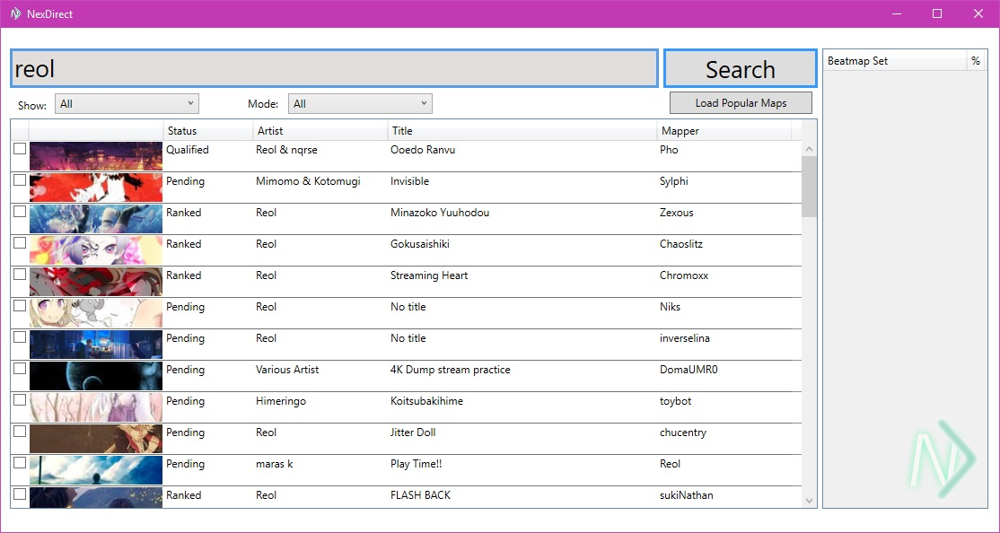
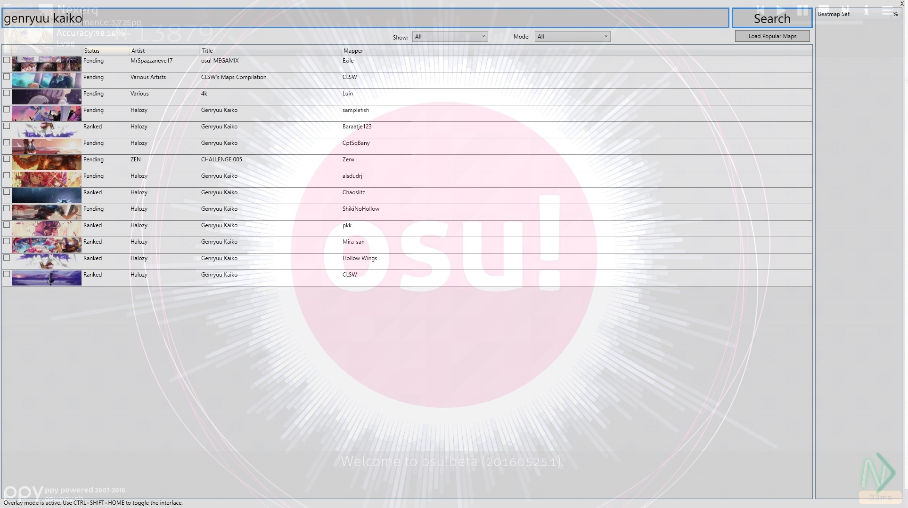

# NexDirect

An alternative, open-source beatmap downloader for the game osu!, written in C#.

## Usage
Binary releases can be found [here in the releases section](https://github.com/nicholastay/NexDirect/releases). Please note that NexDirect is still in development and you may encounter bugs. If you do, please open an issue here on this repository with steps to reproduce it so it can be addressed.

Downloading a beatmap is simple. Just type in the map you wish to download, click search and double click any map to start downloading it.

The settings menu can be accessed by clicking on the NexDirect logo in the bottom right of the interface.

## Previews

## Disclaimer
By using this software, you agree that any damages that it may cause, whether to your osu! account, your computer, whatever... I am not liable for. Basically functioning under the license below.

## License
Licensed under the zlib/libpng license. Full license text can be found in LICENSE.